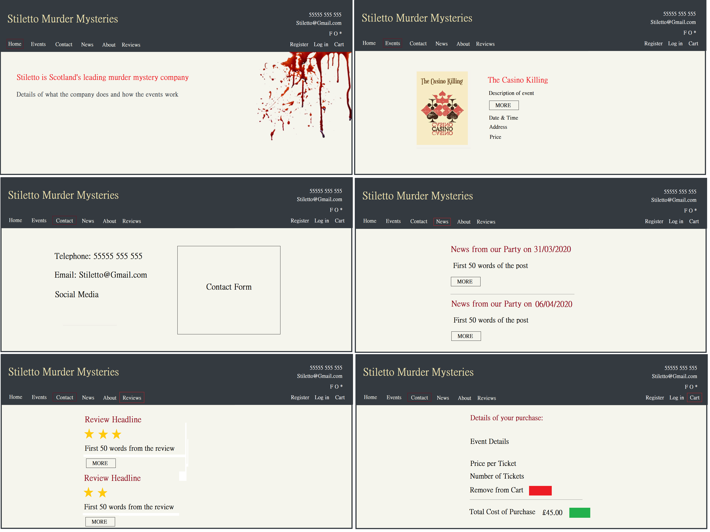
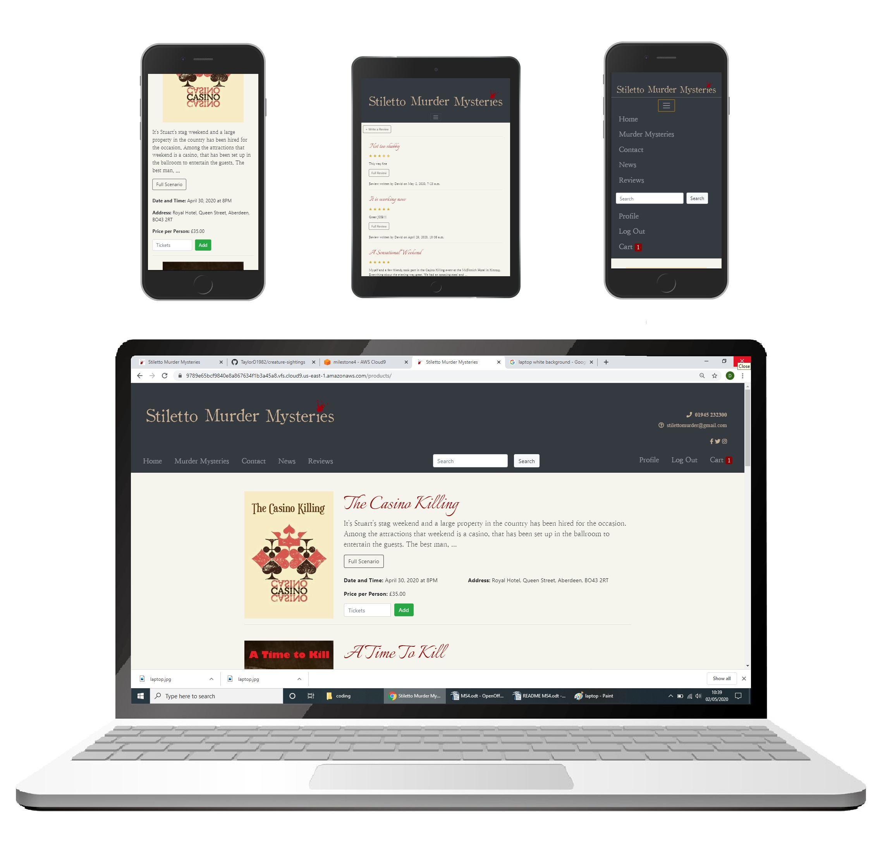
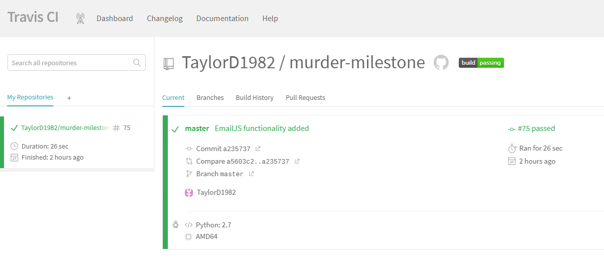

         ___        ______     ____ _                 _  ___  

<h1>Stiletto Murder Mysteries</h1>

Stiletto Murder Mysteries is a company of actors and storytellers who organise Murder Mystery evenings throughout Scotland. The company has devised a number of scenarios, which they stage in hotels and castles across the country with the participation of paying guests.

The purpose of this website is to allow prospective guests to view details of events, read & post reviews, check out the latest news & photos and book tickets to the murder mystery evening of their choice. Visitors to the site may also contact the company directly.
 

<h2>UX</h2>

The site has a simple, clean, layout with a limited colour-scheme of black, dark blue and white contrasted with occasional splashes of crimson. Posters specific to each event provide a contract to the sections of text, as do the star ratings in the review section. The site is designed to be intuitive with the eye drawn to the various colour-coded buttons, for proceeding through the purchase process or cancelling orders.

The original design of the site is shown below. The final version is broadly the same although you will notice one or two changes.
  

<h2>USER STORIES</h2>

Below are a number of scenarios, which demonstrate how a visitor would navigate through the site.
  

<ol>
<li>
<b>David</b> visits the site and decides to find out what others thought of Stiletto Murder Mysteries. He navigates to the reviews section and sees that the top review was positive, giving the evening a 4-star rating. He clicks on the 'Full Review' button and is taken to another page showing the review in its entirety. He returns to the reviews page and reads a second, less positive review. Below, a representative of the company has posted a response to the review, which refutes the feedback and states that they believed the evening to have been a success.
</li> 

<li>
<b>Emma</b> lives in Glasgow and is looking for an event in her city. She goes to the 'Murder Mysteries' page on the site and scrolls down to find a party in that location. An event 'The Hunting Party' is being held in a hotel close to her next month and she decides this would be perfect, so she clicks on the 'Register' button in the Navigation Bar. Once she has registered, she returns to the 'Murder Mysteries' page and adds 3 tickets to her cart. She checks that the details are correct and then proceeds to the checkout, were she enters her payment details and receives a message confirming that her order was processed successfully.
</li> 

<li>
<b>Colin</b> attended an event “A Time to Kill” with a friend who had bought the tickets. Colin thought the production was a waste of money and would like to post a review warning others not to attend. He visits the site and navigates to the reviews page but discovers that he cannot post a review unless he is registered and logged into the site. He decides that he would prefer not to do so and leaves.
</li> 

<li>
<b>Susan</b> has been asked to organise a murder mystery event as part of a team building exercise through work. The event must be private though, so simply purchasing tickets to a public event is not agreeable. She navigates to the “Contact” page on the site and completes the Contact Form, sending a query to the company detailing her requirements. She receives a message confirming that the query was successfully sent.
</li>

<li>
<b>Nick</b> selects an event for himself and 5 friends to attend in Edinburgh next month. He is already logged in so he navigates to the cart and reviews his order. At this point, he realises that he has accidently added 5 tickets for two separate events so he clicks 'Delete' to remove from the cart the event that he had added in error, leaving just the 5 tickets for the correct event. He now notices that he miscounted and forgot to get a ticket for himself, so he amends his order to 6 and then proceeds to the checkout.
</li> 

<li>
<b>Florence</b> is one of the principal actors with the Stiletto Murder Mysteries company. A new member will soon be joining the company and she has been asked to announce this in the News section. She logs in to the 'admin' section of the site and clicks to add a post to the 'Blog' section. Here she adds a title of the post, some content and clicks to publish the company's latest news.
</li>

<li>
<b>Wilfred</b> is responsible for organising events for the company. He has just booked a castle in Sterling for an event in September. He logs into the admin section of the site and adds a new product. Wilfred enters all of the necessary information and saves his updates. Back on the live site, the event has been added, and is at the foot of the page as events are arranged in date order.
</li>

<li>
<b>Jacinta</b>, and actor with Stiletto, took some photos at the most recent event in Dunblane and wants to post these onto the site. She navigates to the admin section of the site and to the photos link. There she is able to add a heading and a description along with the uploaded photos. The results appear on the Photos page in the site, arranged into date order. 
</li>

</ol>

<h2>Features</h2>

<h3>Existing Features</h3>

<ul>
<li><b>Feature 1 (Navbar)</b> - The navbar allows the user to navigate to the various pages that make up the app. It collapses into a ‘burger’ in smaller screen sizes.</li>

<li><b>Feature 2 (Murder Mysteries event description)</b> – The Murder Mysteries page lists all of Stiletto's upcoming events. For each item, the event's poster is displayed along with the date, time, address and price per ticket. Users may click on the 'Full Scenario' button which displays a modal with a full description of the scenario of the party in question. Users can also add a certain number of tickets to their cart from this page.</li>

<li><b>Feature 3 (Contact form)</b> – The contact form allows visitors to easily send an email to the administrators of the site. It is linked to a Gmail account using EmailJS.</li>

<li><b>Feature 4 (News)</b> – The website's administrator can post updates using a form in the admin section of the site. A snippet of each post can then be viewed on the 'News' page, with the full post available by clicking the 'Read More' button.</li> 

<li><b>Feature 5 (Write a Review)</b> – If a visitor is logged into the site, they have the option of posting a new review in the reviews page and assigning a star rating. This option is removed when the visitor is not logged in.</li>

<li><b>Feature 6 (Read reviews)</b> – All visitors to the site can read the reviews posted in the reviews section. They can click on Full Review to view the entire post.</li> 

<li><b>Feature 7 (Review Response)</b> – The site's administrator has the option of posting a response to any review via the admin panel.</li> 

<li><b>Feature 8 (Search box)</b> - The search box allows visitors to search the site for product names matching certain keywords.</li> 

<li><b>Feature 9 (Register)</b> – Users must be registered in order to post reviews and purchase tickets to events. The register mechanism allows them to do so by confirming their email address and inputting a Username and Password.</li> 

<li><b>Feature 10 (Cart)</b> – The Cart page displays confirmation of a customer's order, and allows the user to amend the quantity of tickets and remove an entire event from cart if necessary.</li> 

<li><b>Feature 11 (Checkout)</b> – The checkout displays the total cost of the user's order and allows them to complete their details and pay.</li> 

<li><b>Feature 12 (Social Media Links)</b> – Visitors can be directed to the companies social media accounts via icons on the banner and contact page.</li> 

<li><b>Feature 13 (reset password)</b> – If they have forgotten their password, users can request this be reset by completing their email address.</li>

<li><b>Feature 14 (Photos)</b> – The site's administrator can upload photos to the site, along with a heading and description. These are displayed in the Photos section of the site, arranged into date order.</li>
</ul> 

<h3>Features Left to Implement</h3>

<ul>
<li>The addition of an average review score against each event in the 'Murder Mysteries' page.</li> 
<li>The name of the user who wrote a review to be displayed.</li>
<li>Search for key words in the event details (location, for example) instead of just in the name of the event.</li>
<li>The inclusion of a Back button from the search results page.</li>
</ul>

<h2>Technologies Used</h2>

<ul>
<li><b>JQuery</b> – Simplification of DOM manipulation.</li> 
<li><b>Google Fonts</b> – The typeface used throughout the site. </li>
<li><b>Bootstrap</b> – A front-end framework used throughout the site. </li>
<li><b>MS Paint</b> – Used to create the original design of the site and adjust some of the images.</li>
<li><b>Python</b> – Programming language used throughout the site.</li>
<li><b>HTML</b> – For the structure of the app</li>
<li><b>CSS</b> - CSS was used for Styling</li>
<li><b>JavaScript</b> - JavaScript for application controller</li>
<li><b>Google Chrome</b> - Used for browser and development tools</li>
<li><b>GitHub</b> - Repository hosted on GitHub</li>
<li><b>Heroku</b> -App hosted on Github Pages</li>
<li><b>Django</b> - Web framework</li>
</ul> 

<h2>Testing</h2>

Below is a series of practical tests of the website's functionality

<h3>Navigation Bar</h3>

<ul>
<li>User clicks on the each of the navigation bar items and is correctly taken to the correct page.</li> 
<li>When the user is logged out, the icons “Register” and “Log In” are displayed. When the user is logged in, the icon “Log Out" is displayed instead.</li>
<li>In mobile view, the navigation bar shrinks to a burger image. When clicked on, the navigation items are displayed in a Nav bar that drops down from below the site's banner.</li>
</ul>

<h3>Murder Mysteries</h3>

<ul>
<li>The upcoming events are displayed in date order. Clicking on the “Full Scenario” button displays a modal with a full description of the scenario for that particular mystery.</li>
<li>User clicks “Add” without entering a number into the “Tickets” field and receives a “Please fill in this field” message.</li>
<li>Users enters a figure into the “Tickets” field and clicks “Add”. This adds that order to the cart, which displays the number of tickets in the Navigation Bar.</li>
</ul>

<h3>Contact</h3>

<ul>
<li>Social Media icons on the left hand side of the page can be clicked on, and the user will be directed to the platform selected in a new tab.</li>
<li>The contact form on the right can be completed. By clicking the “Send Message” button an email will be sent via EmailJS and a message will pop up confirming this. If the user fails to complete any section of the form, a message will be displayed stating “Please fill in this field”.</li>
</ul>

<h3>News - User</h3>

<ul>
<li>News items are displayed in date order, with the most recent post shown first.</li> 
<li>When the user clicks on the “Read More” button, they are directed to the full post.</li>
<li>From this page, the user can click on the “Return to Blogs” button and is returned to the news page.</li>
</ul>

<h3>News - Admin</h3>

<ul>
<li>In the Admin section of the site, Administrator clicks to add a post.</li> 
<li>Administrator fails to complete a required field and hits 'Save'. A error message is displayed.</li>
<li>Administrator completes all required fields and hits 'Save'. The post piece of news is published to the site.</li>
</ul>

<h3>Reviews - User</h3>

<ul>
<li>Reviews are displayed in date order, with the most recent review displayed first.</li> 
<li>User clicks on the “Full Review” button and is directed to the page displaying the post in its entirety.</li>
<li>User clicks on the “Back Button” and is returned to the reviews page.</li>
<li>When user is logged out, they have no option to post a review. </li>
<li>When user is logged in, “Write a Review” button is displayed. </li>
<li>User clicks on “Write a Review” button and is directed to page with a form to complete. The first field has a drop down with 5 events to chose from. </li>
<li>The last field has a drop down with 5 possible ratings. </li>
<li>Failure to complete any section of the form will display a “Please fill in this field” message. </li>
<li>Clicking on the “Submit” button will post the review, with the rating rendered in stars. </li>
</ul>

<h3>Reviews - User</h3>

<ul>
<li>Administrator opens a review in the Admin section of the site.</li> 
<li>Administrator completes the "Response" section of the form and hits "Save".</li>
<li>The response has been added to below the review (The div was previously hidden).</li>
</ul>

<h3>Register</h3>

<ul>
<li>User is shown message “Already have an account?”. User clicks on the 'Sign In' button and is redirected to the 'Login' page.</li>
<li>User completes registration form and clicks “Register”. A success message is displayed that reads “You have successfully registered” and the user is automatically logged in.</li> 
<li>User fails to complete any field. “Please fill in this field” message is displayed.</li>
</ul>

<h3>Log In / Log Out</h3>

<ul>
<li>User enters email address and password, clicks on “Login” and is logged into the site.</li> 
<li>User enters incorrect password and receives message saying “Your username or password is incorrect”. User enters incorrect username and receives message saying “Your username or password is incorrect”. </li>
<li>User fails to enter complete both fields and recieves a message stating "Please fill in this field”.</li>
<li>User clicks “Reset Password” and is taken to the password-reset page, where they can enter their email address in the field provided. Clicking the “Reset Password” button without completing this field displays a message stating “Please fill in this field”.</li>
<li>User enters an email address and clicks “Reset Password” and receives a 'Password reset sent' message.</li>
<li>User clicks “Log Out” in the navigation bar. User is logged out and redirected to the home page.</li>
</ul>

<h3>Cart</h3>

<ul>
<li>User visits the Cart page when they have not yet added any tickets to their basket. The page displays the message “Your basket is empty”.</li>
<li>User adds one event ticket to the cart and visits the Cart page. User is shown details of their purchase including the name of the event, event details, price per ticket, number of tickets in cart and the total cost of the order. </li>
<li>User changes number of tickets from 1 to 2 and clicks “Amend Quantity”. Number of tickets and total cost of order both update.</li>
<li>User wishes to remove this event from their cart. User clicks on the “Delete” button, all tickets are removed and page displays message “Your basket is empty”.</li>
<li>User adds 1 ticket from the event “A Time To Kill” and one ticket from the event “The Casino Killing” to their basket. They navigate to the cart. Details of the first event are shown above those of the second. The total cost of the order is displayed correctly at the foot of the page.</li>
<li>User amends the number of tickets for “A Time To Kill” from 1 to 2 and clicks “Amend Quantity”. Number of tickets for this event and total cost of the order both update correctly.</li>
<li>User deletes both tickets for “A Time To Kill” from their basket. This event is completely removed from the cart, leaving only the event “The Casino Killing”.</li>
</ul>

<h3>Checkout</h3>

<ul>
<li>From the Cart page, User clicks “Checkout” and is taken to the checkout page.</li> 
<li>The total cost of the order is correctly displayed at the top of the page. </li>
<li>A form is displayed below allowing the user to input their payment details. User clicks on the button “Submit Payment” without completing every field and receives the message “Please fill in this field”.</li>
<li>User enters out of date credit card. User cannot click pay button (See bugs).</li>
<li>User enters the wrong number of digits into the credit card number field. User cannot click pay button (See bugs).</li>
<li>User correctly completes the form and clicks “Submit Payment”. User is returned to the “Murder Mysteries” page and receives a message stating “You have successfully paid”.</li>
</ul>

<h3>Screen size responsiveness</h3>

<h4>Larger Screens</h4>

<ul>
<li>The banner at the top of the page displays the company name “Stiletto Murder Mysteries” on the left hand side and on the right are shown the company's telephone number and email address, along with the social media links.</li>
<li>The navigation bar displays all of the site’s pages in this view (they are not collapsed).</li>
<li>The modals on the ‘Murder Mysteries” page display the events poster on the right and the event details on the right.</li> 
</ul>

<h4>Smaller Screens</h4>

<ul>
<li>The navigation bar is collapsed into a ‘burger’ on smaller screens.</li>
<li>The Telephone number, email address and social media links are hidden.</li> 
<li>Elsewhere, the modals on the ‘Murder Mysteries” page have the poster above the event details.</li>
<li>On the contact page, the form is below the contact details, instead of side by side.</li> 
<li>On the checkout page, the two sections of the payment form are above each other instead of side by side.</li> 
</ul>
 
<h3>Bugs or problems encountered during testing</h3>

<ul>
<li>If you enter the wrong number of digits in the credit card field and the Submit Payment button will not function. This also happens if out of date card details are entered into the form. <b>I was not able to resolve this bug</b>, but upon reviewing the Code Institute Slack this seems to be a known issue.</li>
<li>The contact form was not working. <b>This was resolved</b> by re-establishing the connection between Email JS and GMail.</li>
<li>In the events page, it was possible to click 'Add' when the number of tickets had not been entered. <b>This was resolved</b> by making the number of tickets a required field.</li>
</ul>

<h3>Other Testing</h3>

Google console was used to inspect the running of the app for any errors.
 

The app was tested using <a href="https://travis-ci.org/github/TaylorD1982/murder-milestone">Travis Continuous Integration</a>

<h2>Deployment</h2>

The project is deployed on <b>Heroku</b>. The code and 'Readme' file are hosted on <b>Github</b>.

The process for deployment on Heroku was:

<ul>
<li>Create a new unique app name in Heroku with “Europe” as the server.</li>
<li>In Heroku, go to settings and Config Vars and add in the DATABASE_URL, Django Secret Key and Stripe Secret Keys. Static file uploads also disabled here</li>
<li>In Heroku, go to Deploy, click on Github and search for the Repo</li>
<li>In Cloud 9, install Gunicorn and add this to the requirements.txt file in order to connect to Heroku</li>
<li>Create a Procfile to tell Heroku what the app type will be</li>
<li>Update settings.py file to allow the site's Heokru url as an allowed host</li>
<li>push code to Github and then deploy the branch in Heroku</li>
</ul>

The process for deployment on Github was:

<ul>
<li>Create new project in Github.</li>
<li>Associate the application with Github, add files and push across using commands provided within Github.</li>
</ul>

<h2>Credits</h2>

<h3>Media</h3>

The images used as the basis for the event posters were found at:

<ul>
<li><a href="https://www.clipdealer.com">www.clipdealer.com</a></li>
<li><a href="https://www.iheart.com">www.iheart.com</a></li>
<li><a href="https://www.pinterest.co.uk/amnakhanengr90/graphicsillustrations">www.pinterest.co.uk/amnakhanengr90</a></li> 
<li><a href="https://www.barewalls.com/posters-art-prints/antique-clock.html">www.barewalls.com/posters-art-prints/antique-clock.html</a></li>
<li><a href="http://www.2yamaha.com/music/Oldtime+Posters.html">www.2yamaha.com/music/Oldtime+Posters.html</a></li>
</ul>

<h3>Acknowledgements</h3>

<ul>
<li>Code Institute</li>
<li>Seun Owonikoko</li>
</ul>
